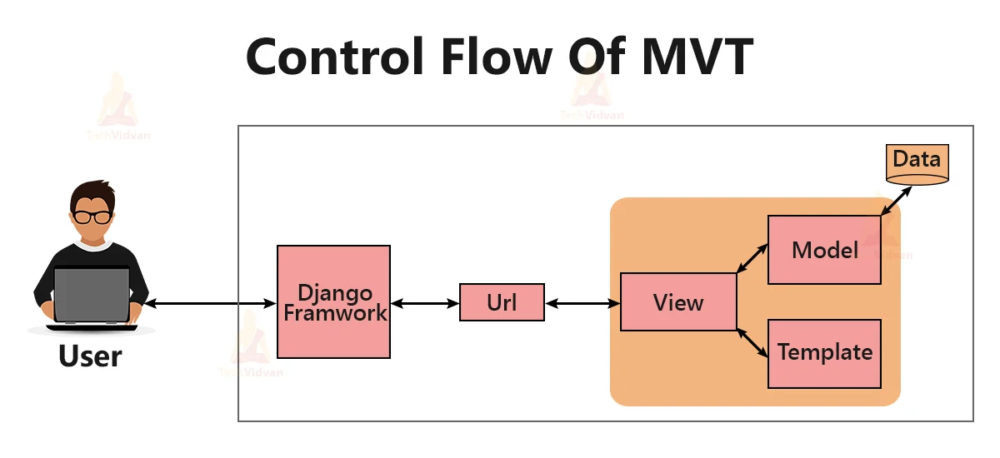

# Django

## What is Django?

https://www.w3schools.com/django/

Django is a Python framework that makes it easier to create web sites using Python.
Django follows the MVT design pattern (Model View Template).

- Model - The data you want to present, usually data from a database.
- View - A request handler that returns the relevant template and content - based on the request from the user.
- Template - A text file (like an HTML file) containing the layout of the web page, with logic on how to display the data.



urls - Django also provides a way to navigate around the different pages in a website. When a user requests a URL, Django decides which view it will send it to. This is done in a file called urls.py.

## development steps

- create venv: python -m venv venv
- activate venv: .\venv\Scripts\activate
- install Django: pip install django
- create Django project: django-admin startproject mysite
- testing project (port can be added at the end of command): python .\mysite\manage.py runserver
- django application.
  - A project refers to the entire application and all its parts.
  - An app refers to a submodule of the project
- creating application named 'main':
  - cd .\mysite
  - python manage.py startapp main
- starting modify views.py.
- creating urls.py file and add wirings for urls
- link application with a project: go to mysite/urls.py and add link to application main/urls.py
- setup db sqlite3
  - change settings.py: add "main.apps.MainConfig" to INSTALLED_APPS. Django uses INSTALLED_APPS as a list of all of the places to look for models, management commands, tests, and other utilities
- db modeling
  - migration: python manage.py migrate
  - add models into models.py
  - tell Django whe was modified the models (Its kind of staging in git): python manage.py makemigrations main
  - in created 0001_initial.py file can be seen exactly what changes in model was performed
  - apply those changes: python manage.py migrate. you can see text: Applying main.0001_initial... OK
- db add items
  - open shell: python manage.py shell
  - write code for creating single ToDoList:
    ```python
    from main.models import ToDoList, Item
    t = ToDoList(name = "Efim\'s List")
    t.save()
    # reading all ToDoLists
    ToDoList.objects.all()
    # reading ToDoList id = 1
    ToDoList.objects.get(id = 1)
    # reading all ToDoLists, contains name "Efim\'s List"
    ToDoList.objects.get(name = "Efim\'s List")
    # adding item into ToDoList is a little different
    # than creation of ToDoList, because of relations
    t.item_set.create(text="Go to the mall", complete = False)
    # reading all items
    t.item_set.all()
    # reading items with id = 1
    t.item_set.get(id=1)
    # deleting
    del_object = t.get(id=1)
    del_object.delete()
    ```
- admin dashboard
  - create login
    - python manager.py createsuperuser
    - add name, email, password
    - save
    - in project db0 user can be seen in table auth_user
  - manager runserver
  - web api: 127.0.0.1:8000/admin
  - insert username and password
  - give the dashboard access to db for manage it
    - goto application admin.py
    - add ToDoList to admin
    - in admin dashboard can be seen ToDoList
- html page
  - add new route to home in application urls
  - add new function of home in views
  - create folder of htmls with same name as application: main/templates/main
  - here create base.html and home.html. Template inheritance. Each inherited page will have the base
  - add binding between view and template. variables from view shown on html
